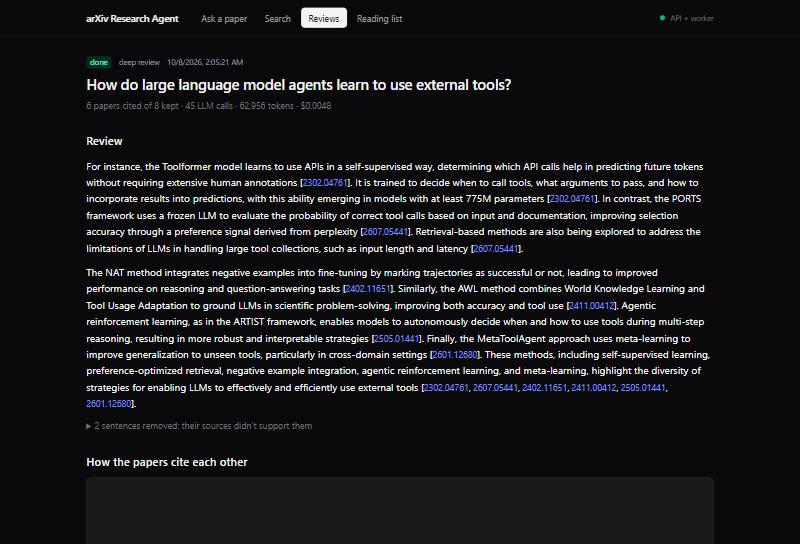
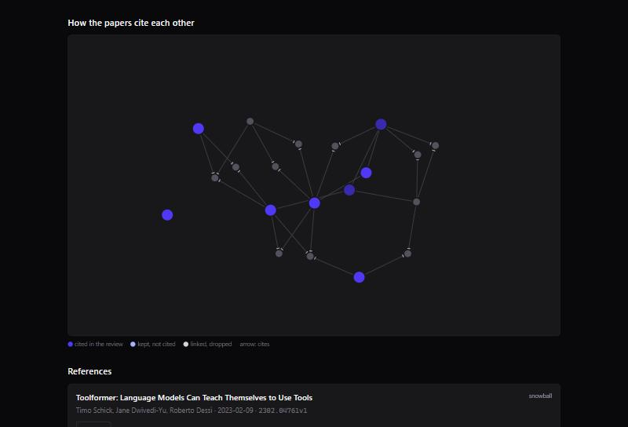
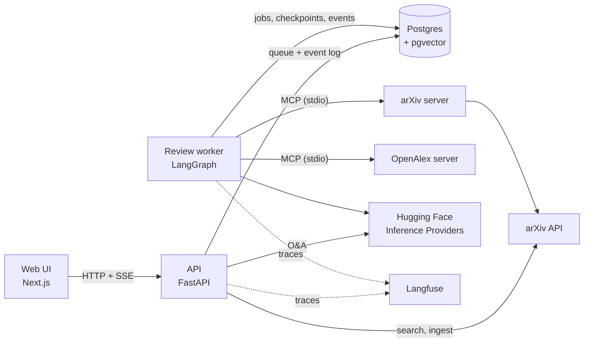

# arXiv Research Agent

Ask a research paper a question, or have a team of agents write a short
literature review, and get an answer in which **every sentence cites the
passage it comes from and has been checked against it** before you see it.


- **Ask a paper.** Hybrid retrieval (dense + BM25 + reranker) over the paper's
  own text; an answer that cites `[S1]`-style passages; a judge from another
  model family checks each sentence, and a sentence its source doesn't support
  is rewritten once or removed. "The paper doesn't say" is a valid answer.
- **Literature review.** A LangGraph pipeline: plan searches, search arXiv,
  screen the candidates, snowball through their references and citations,
  (optionally) pause for you to check the paper list, read the papers, write,
  and have a Critic check every sentence against the claims it cites.
- **Web UI and API.** Progress streams live (SSE); reviews run as background
  jobs you can leave and come back to; a citation graph of the papers;
  a reading list.





## Measured, not assumed

Every component has an eval, and the evals have been checked too.

| What | Result |
|---|---|
| Q&A correctness: 50 questions over 9 papers (QASPER + a survey paper; answerable, unanswerable, false premise), graded by an LLM judge from a different model family | **0.87** (3-run baseline) |
| Hybrid retrieval + cross-encoder reranking vs dense only | evidence recall@5 **0.68 → 0.91**, correctness 0.76 → 0.83 |
| Literature reviews vs 5 survey papers' bibliographies | kept precision 0.50 (**1.8×** the candidate pool); snowballed papers were expert-cited **53%** of the time vs 21% for searched ones |
| Judging the judge: sentences broken on purpose by code (changed number, negated, overgeneralized, wrong source) | caught **94%** with 0 false alarms (82% before a code number check and a stricter prompt; a same-family judge caught 50%) |
| Repair vs remove, where the support check fired | correctness **0.31 → 0.93**, with every planted error still gone |
| Prompt-injection guard on 105 attacks written without seeing it | the regex guard caught 9/9 of its own red team but **5%** of these; a trained classifier caught 58% but falsely blocked **4.4%** of real sentences. None of the attacks moved the Screener even unguarded, so the regex stays |
| CI eval gate (paired, noise-aware) | passes reruns of the same system; fails a change from 5 retrieved sources to 3 (**−7.7 points**, 3.9 SE) |

## How it works



- **Models:** Qwen3-32B writes; Llama-3.3-70B judges (a different family, so
  it doesn't share the writer's blind spots); `bge-small-en-v1.5` embeddings and
  an `ms-marco-MiniLM` cross-encoder run locally on CPU.
- **Guardrails, in layers:** paper text is data (fence tags stripped, injected
  instructions removed, hidden text reported); citations must point to real
  passages; quotes are checked by code; numbers in a claim must appear in its
  source; links only to arXiv/DOI/Semantic Scholar; prompt leaks blocked.
- **Reviews are jobs:** a Postgres queue (`FOR UPDATE SKIP LOCKED`), one worker
  (advisory lock), a numbered event log the UI replays after reconnecting,
  checkpoints so a paused or crashed review resumes where it stopped, a budget
  (LLM calls, tokens, seconds) checked between steps.
- **arXiv's limits are respected across processes:** one connection and one
  request every 3 s, enforced through Postgres for the API, the worker and its
  MCP server together. Paper text is never committed.
- **Evals in CI:** lint and ~500 tests on every PR; a 20-question eval gate on
  PRs and the full set on main, compared per question against a committed
  baseline with a tolerance taken from measured run-to-run noise.
- **A flywheel:** flagged answers, Critic removals and reviewers' edits are
  harvested, triaged by a person, and become eval cases.

## Run it

You need Docker and a [Hugging Face token](https://huggingface.co/settings/tokens)
with Inference Providers access (a review costs well under a cent).

```bash
cp .env.example .env    # set HF_TOKEN, POSTGRES_PASSWORD and the arXiv contact
docker compose --profile app up -d --build
```

Open http://localhost:3000. Ask a paper by its arXiv id (index it first with
the button), or start a review. The first start downloads the two local
models (~200 MB); later starts take seconds. Langfuse keys in `.env` turn on
tracing.

## Develop

```bash
uv sync                                             # Python 3.12
docker compose up -d                                # the database only
uv run --env-file .env python -m pytest             # tests
uv run --env-file .env python -m uvicorn arxiv_agent.api.app:app --port 8000
uv run --env-file .env python scripts/review_worker.py
uv run --env-file .env python scripts/ingest_papers.py --from-evals
uv run --env-file .env python scripts/run_eval.py   # the Q&A eval
uv run --env-file .env python scripts/eval_gate.py --suite pr
```

The web UI is in [`web/`](web/README.md).

```
src/arxiv_agent/
  clients/       arXiv (paced across processes) and OpenAlex
  ingestion/     HTML parsing, chunking, embeddings
  retrieval/     BM25, dense, fusion, reranker
  qa/            the Answerer, answer checks, the support check
  review/        the literature-review graph: nodes, Reader, Writer, Critic
  guardrails/    content and output guards
  mcp_servers/   arXiv and OpenAlex as MCP servers
  tools/         the MCP toolbox and a tool-calling loop
  storage/       chunks + vectors, review jobs, the reading list
  evals/         judges, eval runners, the CI gate, the flywheel
  api/           FastAPI routes and SSE streams
scripts/         CLIs: ask, review, ingest, evals, worker
evals/           eval sets and the gate baseline (no paper text)
web/             Next.js UI
```
